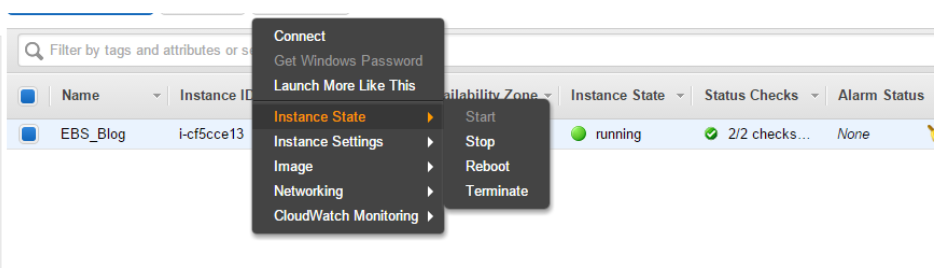
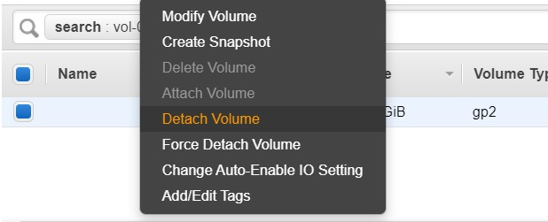
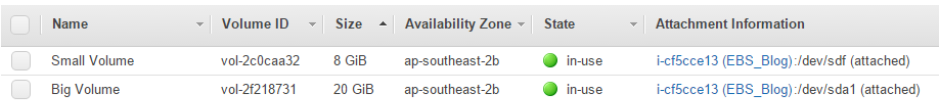

# *pyflexebs* project by Mark Veltzer


pyflexebs will allow you to monitor and expand/contract you ebs in aws

project website: https://veltzer.github.io/pyflexebs

chat with me at [](https://gitter.im/veltzer/mark.veltzer)

# How to create a package this code?

Make sure you have internet access, as the following commands may pull packages off the internet.

Install git

On a yum system:

    $ sudo yum install git

On an apt system:

    $ sudo apt install git

Clone the repository:

    $ git clone https://github.com/veltzer/pyflexebs

CD into the repository:

    $ cd pyflexebs

Build the executable

On a yum system:

    $ ./build.yum.sh

On an apt system:
    
    $ ./build.apt.sh

The result is in the ***dist*** folder in a file called ***pyflexebs-[VERSION]***.
This file is an executable that should run on all linux platforms.


# How to install this package as a service?

    $ sudo ./pyflexebs-[version] service_install


# How to remove this package as a service?

    $ sudo ./pyflexebs-[version] service_uninstall


# How to start the service

    $ sudo ./pyflexebs-[version] service_start

or

    $ sudo systemctl start pyflexebs.service


# How to stop the service
    
    $ sudo ./pyflexebs-[version] service_stop

or

    $ sudo systemctl stop pyflexebs.service


# How to configure the service

After installing the service you will get a config file called ***/etc/pyflexebs.json***.
This is the configuration file for the service. Any change in parameters in this file
will effect the ***next*** run. Edit this to your hearts content. If you don't know what
a specific parameter means just use:

    $ ./pyflexebs-[version] daemon_run --help


Remember to configure proxy information if you need it. It can be configured in the config
file in the following lines:

    "no_proxy": "localhost,169.254.169.254",
    "http_proxy": null,
    "https_proxy": null,


# Reducing AWS EBS Volumes

Assuming we want to reduce EBS, the first thing we will need to do is to make a note of the root volume’s block device name and our instance’s availability zone

1. Stop the instance
  
2. Detach the volume from instance
  
3. Create a new instance

5. Create an empty Amazon EBS volume with size require in the same availability zone
  

6. Attach both volumes to the instance and again note all device name details.

Block Device Name Big Volume = /dev/sdb
Block Device Name Small Volume = /dev/sdg

7. Restart the Instance and Login:

Create a file system for the new volume you have created
```
sudo mkfs -t ext4 /dev/xvdg
```
Create two mount directories and mount the new volumes.
```
sudo mkdir /mnt/big
sudo mount /dev/xvdf /mnt/big
sudo mkdir /mnt/small
sudo mount /dev/xvdg /mnt/small
```
Sync big to small
```
rsync -aHAXxSP /mnt/real/ /mnt/small
```
Umount the smaller
```
umount /dev/xvdg
```
8.	Stop new instance

9.	Detach the small volume from new instance

10.	Attached the small volume to orig instance with same block device

11.	Start the orig instance

12.	Login instance #1
a.	Mount small disk
mount  /dev/xvdb /mnt/xvdb

13. After every thing is working you can remove the big volume. recommend to save it for 1-2 week before removing


